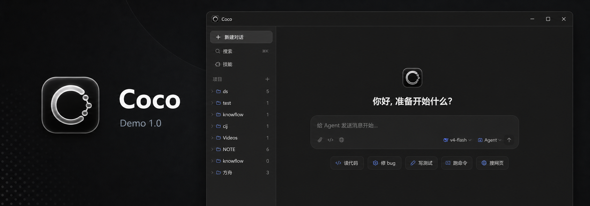

<p align="center">
  
</p>

<h1 align="center">Crown</h1>

<p align="center">
  一个面向桌面端的 AI Agent 客户端。
  <br />
  基于 Tauri + Rust + React + TypeScript 构建。
</p>

<p align="center">
  
  
  
  
</p>

---

## 这是什么？

Crown 是一个基于 **Tauri + Rust + React + TypeScript** 的桌面 AI Agent 客户端，通过自然语言驱动大模型执行文件操作、代码编辑、Shell 命令、网页搜索等任务。

## 功能概览

| 模块 | 状态 | 说明 |
| --- | --- | --- |
| 桌面客户端 | 可用 | Tauri 桌面壳，Windows 安装包 |
| 项目 / 会话 | 可用 | 项目列表、线程和历史消息管理 |
| 模型配置 | 可用 | Provider 配置与多模型切换 |
| Web Search 配置 | 可用 | 多搜索供应商管理与 API Key 配置 |
| Web Search 执行 | 可用 | Jina、DuckDuckGo、Bocha、Brave、Tavily、Exa、Serper、SerpAPI |
| MCP / Skills | 可用 | 服务管理、技能发现和加载 |
| 终端 / 文件工具 | 可用 | PTY 终端、文件浏览、工具卡片 |
| 错误兜底 | 可用 | 前端异常兜底页面 |

## Web Search 支持

- Jina Search
- DuckDuckGo HTML
- Bocha AI Search
- Brave Search API
- Tavily
- Exa
- Serper
- SerpAPI

## 隐私和安全

- 不提交 `.env`、日志、安装包、临时截图和本地营销文件
- 不提交真实 API Key、Token、Cookie 或用户本地配置
- API Key 保存在本机应用配置文件中，请把本机账户视为信任边界

## 安装

在 GitHub Releases 下载安装包：

```text
Crown_1.3.2_x64-setup.exe
```

安装后打开 Crown，在设置页配置模型或 Web Search API Key。

## 本地开发

准备环境：

- Rust stable
- Node.js 18+
- npm
- Tauri CLI

安装前端依赖：

```bash
cd frontend
npm install
```

启动前端：

```bash
cd frontend
npm run dev
```

启动桌面端：

```bash
cd crates/app
cargo tauri dev
```

构建前端：

```bash
cd frontend
npm run build
```

构建 Windows 安装包：

```bash
cd crates/app
cargo tauri build
```

构建产物位于：

```text
target/release/bundle/nsis/
```

## 目录结构

```text
.
├─ crates/
│  ├─ app        # Tauri 桌面应用、IPC、打包配置
│  ├─ core       # Agent 引擎、权限、记忆、上下文处理
│  ├─ client     # 模型 API 客户端
│  ├─ tools      # 文件、Shell、Web Search、Web Fetch 等工具
│  ├─ state      # SQLite 本地状态
│  ├─ mcp        # MCP 管理和桥接
│  ├─ skill      # Skill 发现与加载
│  └─ tokenizer  # Token 估算和上下文预算
├─ frontend/     # React / TypeScript 前端
└─ docs/         # 对外文档
```

## License

MIT
